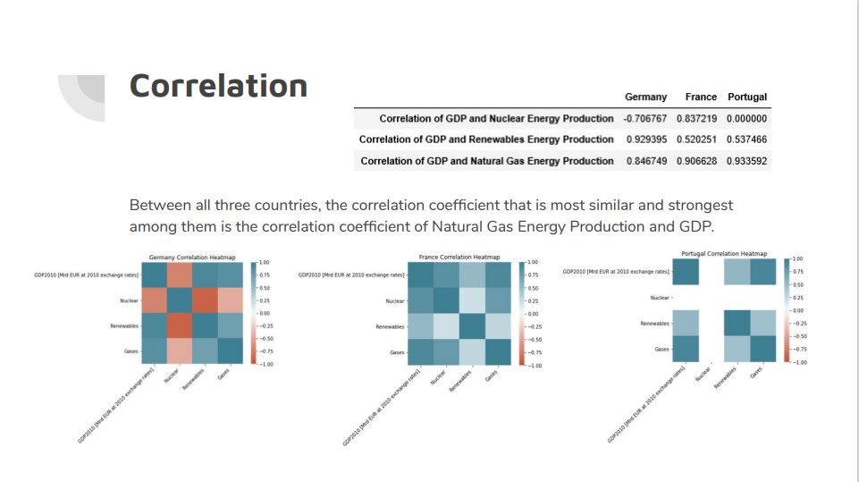

# gt4801_project
Data Visualization Project for GT4801
Made using Jupyter Ntebook and Python. 

###Libraries used: 
Pandas, Seaborn, Matplotlib, Chart Studio, Plotly

###Focus: 
Visualization of Trends in European Union Electricity Production and economic indicators over the transition to the 21st century.
###Goals: 
Achieve successful insight into trends using data visualization, successfully utilize Jupyter Notebook and Python libraries to achieve this.

